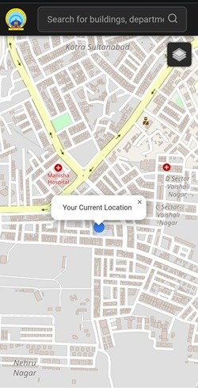

# MANIT Navigation System



A web-based navigation system for the **Maulana Azad National Institute of Technology (MANIT)** campus in Bhopal, India. This application allows users to search for locations (e.g., academic buildings, hostels, facilities), view them on an interactive map, and find walking/driving routes from their current location to a selected destination. Built with *Leaflet.js*, *PHP*, and *MySQL*, it integrates real-time data from a local database and supports both street and satellite views.

## **Features**
- **Interactive Map**: Powered by *Leaflet.js* with *OpenStreetMap* (street view) and *Esri World Imagery* (satellite view).
- **Location Search**: Search for campus locations by name or description with real-time suggestions.
- **Route Finding**: Calculate routes with distance and estimated time using the *OSRM* routing service.
- **Dynamic Markers**: Blue pin for selected locations turns red after route calculation.
- **Touch-Friendly**: Pinch-to-zoom enabled on touch devices; manual zoom controls disabled for a mobile-first experience.
- **Layer Control**: Toggle between street and satellite views, with the layer modal auto-closing after selection.
- **Database Integration**: Locations fetched from a *MySQL* database via *PHP*, hosted locally with *XAMPP*.
- **Responsive Design**: Dark-themed UI with mobile optimization (navbar title hidden on small screens).

## **Prerequisites**
- **XAMPP**: Local server with *Apache* and *MySQL* (download from [apachefriends.org](https://www.apachefriends.org/)).
- **Web Browser**: Modern browser (Chrome, Firefox, etc.) for testing.
- **Git**: To clone the repository.

## **Setup Instructions**

### 1. Clone the Repository
```bash
git clone https://github.com/your-username/manit-navigation-system.git
cd manit-navigation-system
